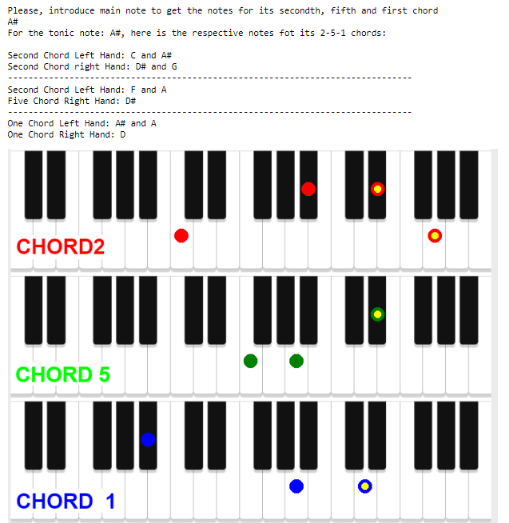

# 2-5-1 Chord Helper for Piano Players
This program is designed to assist piano players in playing the common 2-5-1 chord progression. 

It provides guidance on which notes to play with both hands for each chord in the progression. 

The user simply needs to input the tonic note, and the program will then display the appropriate notes to play for the 2, 5, and 1 chords. 

This makes it easier for piano players to navigate the 2-5-1 progression and improve their playing experience.

**RIGHT HAND NOTES HAVE ONLY A COLOR CIRCLE.**

**LEFT HAND NOTES HAVE ALSO A SMALL YELLOW CIRCLE INSIDE**

